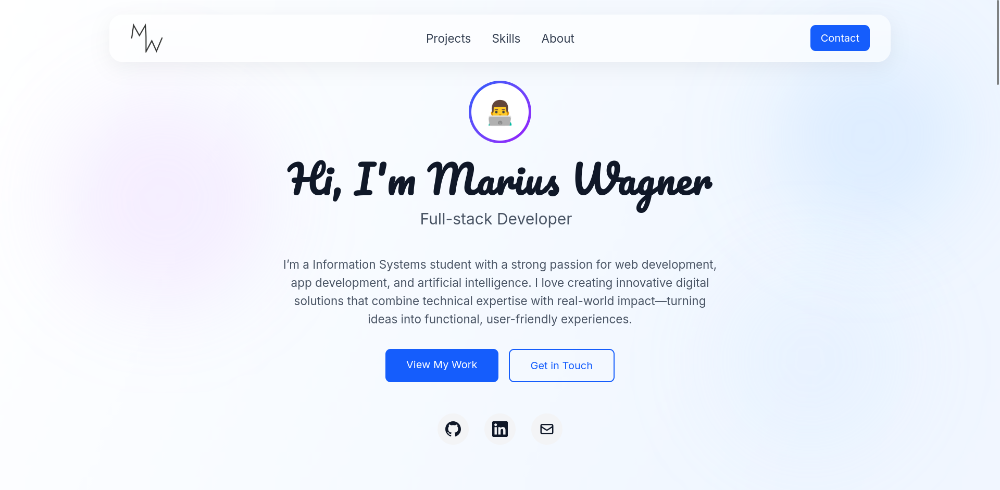

# marius1501.github.io

## That's my website. Check it out!

- 👋 Hi, I’m @Marius1501 
- 👀 I’m interested in:
  • Web- and App Development
  • Machine- and Deep Learning
- 💻My programming languages:
  • Java
  • JavaScript
  • TypeScript
  • Python
  • Kotlin
- 📫 How to reach me: malemo2001@gmail.com or marius.wagner@tum.de

<b>📈 Github Stats</b>

 
  
  

<!---
Marius1501/Marius1501 is a ✨ special ✨ repository because its `README.md` (this file) appears on your GitHub profile.
You can click the Preview link to take a look at your changes.
--->
